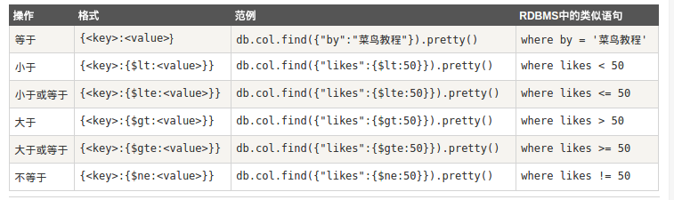
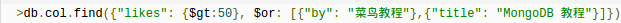

## NoSQL初学习
### 启动服务
- 配置各种文件目录
- mongod.conf
	> port = 12345
	> dbpath = data
	> logpath = log/mongod.log
	> fork = true

- ./bin/mongod -f conf/mongod.conf 开启服务
### 客户端连接
1. 用mongo连接
  -  bin/mongo [options] [db address] [file names (ending in .js)]
  > bin/mongo 127.0.0.1:12345/test
  - ...
  - 断开连接

2. PHP连接

### 基本操作
- show dbs 库http://gxxnr.cn/mobile/article.php?act=detail&a_id=163
- show collections 表
- use xxx库  // 会自动生成库http://gxxnr.cn/mobile/article.php?act=detail&a_id=181
- db.dropDatabase() // 删除当前库
- db.xxx表.drop() // 删除该表
- db.xxx表.insert({json:1})  // 会自动生成表,支持for循环。。
	> for(i=4;i<100;i++)db.zwd.insert({x:i})
- db.xxx表.find().pretty() //默认返回所有 还有findONe() ？？pretty 好的格式输出
    > 查询条件。
	> 
	>  db.zwd.find().skip(3).limit(2).sort({x:1}) // skip跳过前几条，limit限制输出，sort排序？？

- db.xxx.update({A},{$set:{B}},false,false)
	> // 第一个为查询条件，第二个为更改的条件{$set:{}}为只更改这一条件，第三个参数表明若不存在则成生一条这样的数据B，第四个为更改的条目，默认为搜索到的第一条
- db.xxx.remove({A}) // 删除所有搜索到的数据

### 索引
- db.tablename.getIndexes() //获取当前索引
- db.tablename.ensureIndex({key:1}) //建立索引.{key:value} value：1为顺序，-1为逆序
- 单键索引
- 多键索引（支持数组）？
- 复合索引 //多个查询条件的情况下
- 过期索引
	>	ensureIndex({time:1},{expireAfterSeconds:10})
	>	必须是时间类型数据数组，~new Date()。数组按照最小时间删除
	>	不能是复合索引，删除时间不精确。。
- 全文索引
	-	db.xxx.ensureIndex({key:"text"}) // 建立
	-	db.xxx.find({$text:{$search:"lyp"}}) // 使用 搜索的字符串不能是单个字符？
		> "aa bb" ——搜索 aa 或 bb
		> "aa -bb" ——搜索 aa 不包含 bb
		> 转义\\\\
	-	db.imooc.find({$text:{$search:"love"}},{score:{$meta:"textScore"}}).sort({score:{$meta:"textScore"}}) //相似度。。并排序
	-
