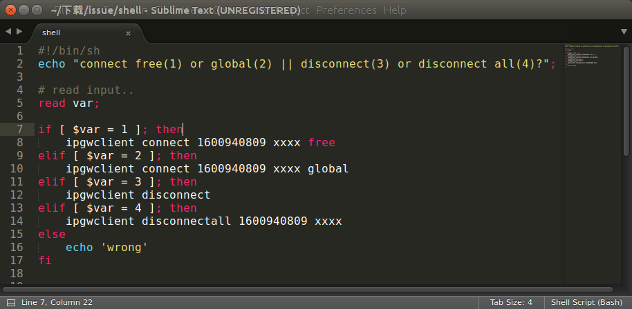

## ubuntu 相关

### something...
- 之前写的一堆东西，都没了，gg。。。
- 从现在开始，能记录多少是多少。
- 直到。某天又要重装的时候。。
- 也许就不装ubuntu了2333

### 正文
- chrome字体发虚解决方案[这里](http://www.findspace.name/res/1388)
- [赵炯 linux内核完全注释](http://download.csdn.net/detail/skyline_loafer/8215693)

### 目录结构
- /etc： 上边也提到了，这个是系统中的配置文件，如果你更改了该目录下的某个文件可能会导致系统不能启动。
- /bin, /sbin, /usr/bin, /usr/sbin: 这是系统预设的执行文件的放置目录，比如 ls 就是在/bin/ls 目录下的。值得提出的是，/bin, /usr/bin 是给系统用户使用的指令（除root外的通用户），而/sbin, /usr/sbin 则是给root使用的指令。
- /var： 这是一个非常重要的目录，系统上跑了很多程序，那么每个程序都会有相应的日志产生，而这些日志就被记录到这个目录下，具体在/var/log 目录下，另外mail的预设放置也是在这里。

### xampp
- 自己配过apache，mysql。。但是有点麻烦。就。。
- 在opt/lampp目录下
  - sudo opt/lampp/lampp start(stop)
  - 或者cd到后  sudo ./manager-linux-x64.run 有图形界面。

### sublime
- [解决中文输入](http://www.jianshu.com/p/bf05fb3a4709)

### git
-  添加新的ssh密码后。
-  记得ssh-add。
-  才能通过认证。。

### PATH～
- ~/.bashrc 是当前用户的
	- ~/.profile 加载 bashrc 	
- /etc/profile 是整个系统的。
	- /etc/environment 也是整个系统的，“稍微特殊的写法”
- 终端下 sudo export PATH="$PATH:your path1:your path2 …"
	- 仅在当前终端下有效

### shell编程
- 文件开头 #!/bin/sh
- chmod +x filename //一次即可
- 运行 ./filename
- 